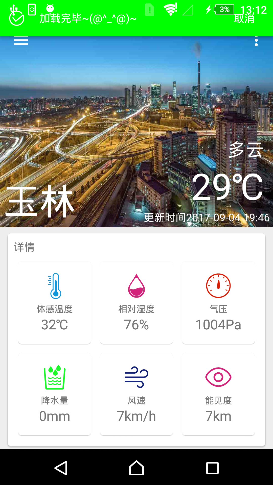
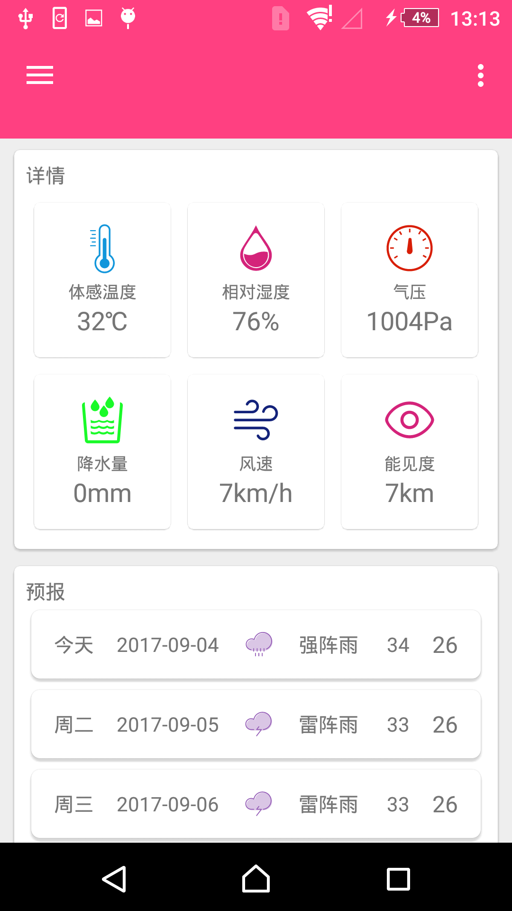
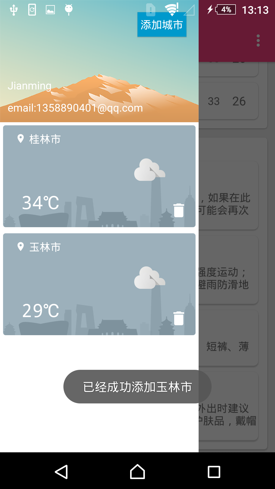
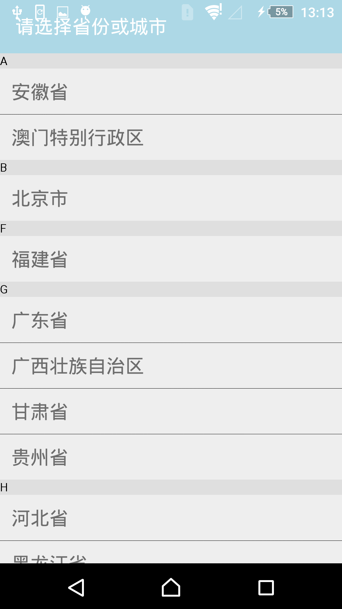

PerfectWeather
==============
perfectweather(完美天气)是一个基于MVP架构的天气应用，rxjava+retrofit+okhttp;
 
## screenshot
       
    

## 简介
第一个小demo，因为很多地方参考了别人的demo，代码难免比较粗糙。天气接口用的是和风天气，由于API的限制，只能获取未来三天的天气预报。
定位接口采用的是高德。主要用到的第三方lib有rxjava，retrofit，okhttp，Rxpermission，butterknife等

 
License
============
    Copyright 2017 AbbyJM.

    Licensed under the Apache License, Version 2.0 (the "License");
    you may not use this file except in compliance with the License.
    You may obtain a copy of the License at

       http://www.apache.org/licenses/LICENSE-2.0

    Unless required by applicable law or agreed to in writing, software
    distributed under the License is distributed on an "AS IS" BASIS,
    WITHOUT WARRANTIES OR CONDITIONS OF ANY KIND, either express or implied.
    See the License for the specific language governing permissions and
    limitations under the License.
